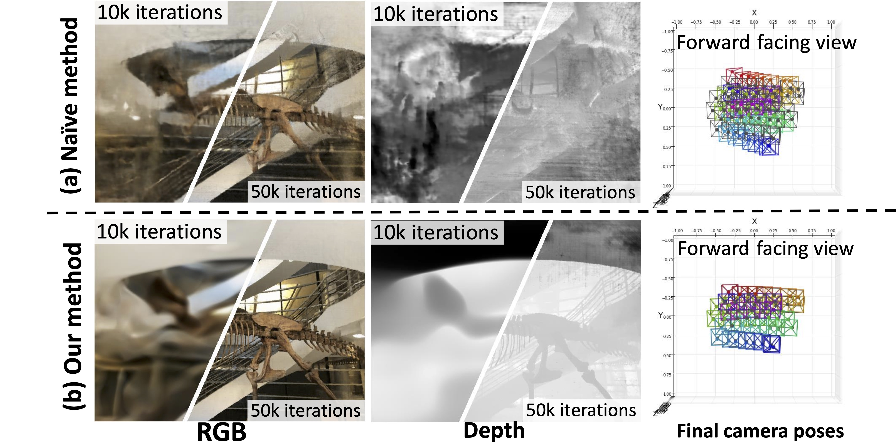
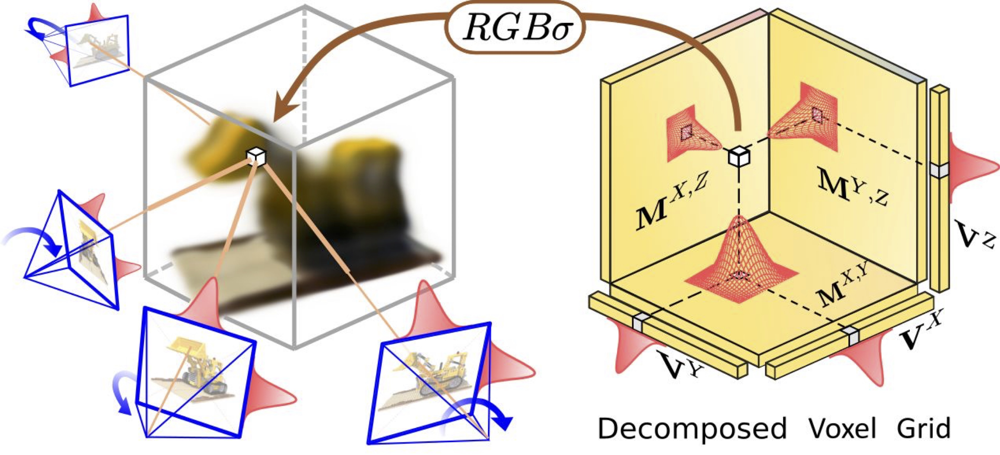

  - [Introduction](#sec-1)
      - [Robustify Joint Pose Optimization with Randomized 2D/3D Filtering and Edge-Guided Loss Mask](#sec-1-0-1)
      - [Efficient Separable Component-Wise Convolution](#sec-1-0-2)
  - [Environment Setup](#sec-2)
      - [Create Conda Environment](#sec-2-0-1)
      - [Download Datasets](#sec-2-0-2)
  - [Reproduce Experiments](#sec-3)
      - [Blender Dataset](#sec-3-0-1)
      - [LLFF Dataset](#sec-3-0-2)
  - [Acknowledgement](#sec-4)
 
  

# Introduction<a id="sec-1"></a>

Official Code Release for **AAAI 2024** Paper : Improving Robustness for Joint Optimization of Camera Poses and Decomposed Low-Rank Tensorial Radiance Fields

-   [Project Page Link](https://alex04072000.github.io/Joint-TensoRF/)
-   [Poster (PDF)](https://alex04072000.github.io/Joint-TensoRF/img/AAAI_Poster_Official.pdf)
-   [Paper (Arxiv)](https://arxiv.org/abs/2402.13252)
-   [Supplementary (PDF)](https://alex04072000.github.io/Joint-TensoRF/suppl.pdf)

The release code is experimental and is not very stable, please raise issue to help improve the project.

### Robustify Joint Pose Optimization with Randomized 2D/3D Filtering and Edge-Guided Loss Mask<a id="sec-1-0-1"></a>

 (a) Naively applying joint optimization on voxel-based NeRFs leads to dramatic failure as premature high-frequency signals in the voxel volume would curse the camera poses to stuck in local minima. (b) We propose a computationally effective manner to directly control the spectrum of the radiance field by performing separable component-wise convolution of Gaussian filters on the decomposed tensor. The proposed training scheme allows the joint optimization to converge successfully to a better solution.

### Efficient Separable Component-Wise Convolution<a id="sec-1-0-2"></a>



Our method enables joint optimization of camera poses and decomposed voxel representation by applying efficient separable component-wise convolution of Gaussian filters on 3D tensor volume and 2D supervision images.

# Environment Setup<a id="sec-2"></a>

### Create Conda Environment<a id="sec-2-0-1"></a>

1.  Install [conda environment](https://docs.conda.io/projects/conda/en/latest/user-guide/install/index.html)
2.  Create conda env:

```bash
# activate conda env
conda activate
# project root
cd Bundle_Adjusting_TensoRF
# create conda env ( Bundle_Adjusting_TensoRF )
bash ./env_setup/install.sh
```

### Download Datasets<a id="sec-2-0-2"></a>

Run the following scripts:

```bash
# activate conda env
conda activate Bundle_Adjusting_TensoRF
# dowload and unzip NeRF Datasets
./env_setup/dataset.sh
```

**If the `dataset.sh` doesn't work** : try to manually download the files from google drive

-   Download and unzip `nerf_synthetic.zip` and `nerf_llff_data.zip` from [NeRF Google Drive](https://drive.google.com/drive/folders/128yBriW1IG_3NJ5Rp7APSTZsJqdJdfc1)
-   Rename the directories to `blender` and `llff` respectively
-   Move the directories to `Bundle_Adjusting_TensoRF/data/blender` and `Bundle_Adjusting_TensoRF/data/llff`

# Reproduce Experiments<a id="sec-3"></a>

-   The project structure and training interface (options & yaml files) are inherited from [BARF](https://github.com/chenhsuanlin/bundle-adjusting-NeRF)
    -   For common settings, user can specify options in yaml files in `options/`
    -   When directly running `train_3d.py`, user can override options in cmd with `--<key1>.<key2>=<value12> --<key3>=<value3>`
    -   When running multiple experiments with our newly added `scripts/gpu_scheduler.py`, user can override default options with `{"key1.key2": value}` python dictionary item
-   It is strongly recommend to perform training and evaluation with `RunConfigsGPUScheduler.default_use_wandb=True` (default behaviour) because we log a lot of useful informations in [Weights & Bias Platform](https://wandb.ai/site), including:
    -   All Quantitative Results
    -   Visualizing Training Process and Animations
    -   Depth Map and Depth Animations
    -   Camera Poses and Camera Poses Animations
    -   Final Results and Animation

### Blender Dataset<a id="sec-3-0-1"></a>

-   Option1: Training + Evaluation in 1 Step
    -   It is recommended to lower the testing split `data.test_sub` in yaml file or python config, otherwise the evaluation time will be longer than training time.

```bash
python -m scripts.train_and_evaluate_bat_blender
```

-   Opiton2: Separate Training & Evaluation (for timing purpose)

```bash
# tranining , save checkpoint in `output` directory 
python -m scripts.train_bat_blender

# don't change config in between the separated training and evaluation

# evaluation, auto load checkpoint and evaluate based on that , upload evaluation results to wandb as a separate run
python -m scripts.evaluate_bat_blender
```

### LLFF Dataset<a id="sec-3-0-2"></a>

-   Option1: Training + Evaluation in 1 Step (recommended)

```bash
python -m scripts.train_and_evaluate_bat_llff
```

-   Opiton2: Separate Training & Evaluation (for timing purpose)

```bash
# tranining , save checkpoint in `output` directory 
python -m scripts.train_bat_llff

# don't change config in between the separated training and evaluation

# evaluation, auto load checkpoint and evaluate based on that , upload evaluation results to wandb as a separate run
python -m scripts.evaluate_bat_llff
```

# Acknowdgement <a id="sec-4"></a>

The code of this project is modified from https://github.com/chenhsuanlin/bundle-adjusting-NeRF

Huge thanks to *Lin, Chen-Hsuan* , *Ma, Wei-Chiu* , *Torralba, Antonio* and *Lucey, Simon* for open-sourcing great codebase!

